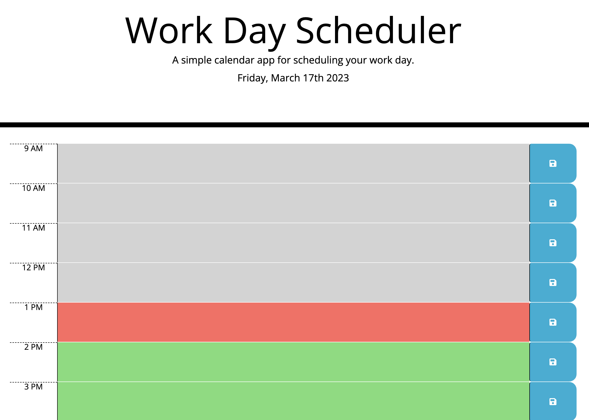

# Bootcamp Module 7 Challenge: Daily Planner App

## Description

Making use of Moment.js capabilities, the daily planner app allows a user to type and save appointments.

The daily planner app is color-blocked: grey blocks correspond to past time, red to current time and green to future appointments.

## Demo

## GitHub Pages

Deployed version of this project can be seen [here](https://vcdsc.github.io/daily-planner-app/).

## License

Please refer to the LICENSE in the repo.
